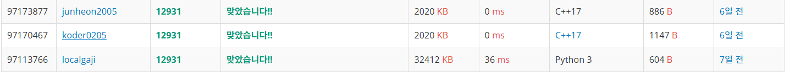

# 12931

## 고수 아이디: koder0205
## 고수 등급: 다이아4

## 소감:

  - typedef 라는 것을 사용해서 타입을 지정해서 문제를 푸는 모습을 확인했다.

  - 알고리즘 문제를 풀때도 상당히 디자인 패턴을 지키면서 깔끔하게 푸는 모습이 인상적이었다.

  - <bits/stdc++.h> 이걸 임포트 하는데 이게 뭔지 한번 알아봐야 겠다.

## 공부할 점:

  - 나는 일단 typedef라는 것을 사용하는 방법을 익히자

  - 변수들을 정리해서 코드 재사용성을 높이는 방안으로 작성하는 습관을 들이자. 
